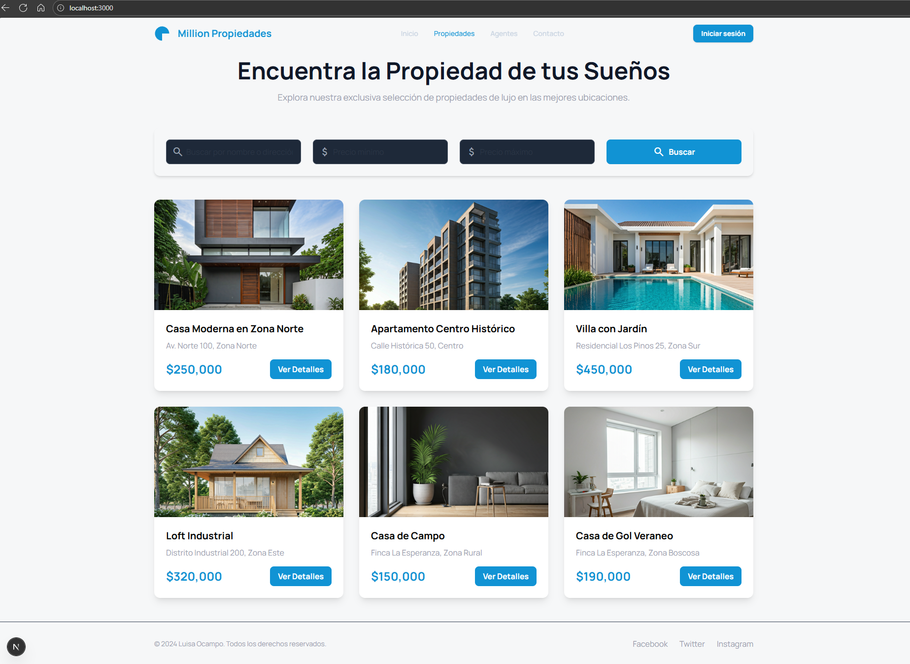
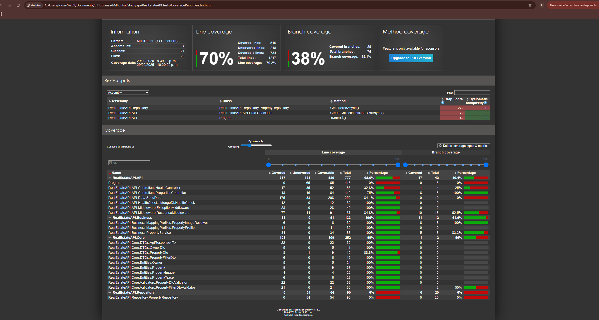

# Real Estate Management System

Sistema full stack para gestión de propiedades inmobiliarias desarrollado con .NET 9 y Next.js.

## 📸 Capturas del Sistema

### Backend - API Swagger


### API - Consulta de Propiedades


### Frontend - Lista de Propiedades


### Frontend - Detalles de Propiedad


### Base de Datos - Colecciones MongoDB


### Tests Unitarios


## Inicio Rápido

### Prerrequisitos
- .NET 9 SDK
- Node.js 18+
- MongoDB

### Backend
```bash
cd api
dotnet restore
dotnet run --project RealEstateAPI.API
```
La API se abre automáticamente en Swagger: `https://localhost:7030/swagger/index.html`

### Frontend
```bash
cd front
npm install
cp env.example .env.local
npm run dev
```
Editar `.env.local` con la URL de la API:
```env
NEXT_PUBLIC_API_URL=https://localhost:7030/api
```

### Base de Datos
Los datos de ejemplo se cargan automáticamente al iniciar la API.

**Backup de MongoDB:**
```bash
mongodump --db RealEstateDB --out ./backup
```

## Funcionalidades

- API REST con filtros por nombre, dirección y rango de precios
- Frontend responsive con Next.js
- Tests unitarios con NUnit
- Arquitectura limpia con separación de capas

## Tests

```bash
cd api/RealEstateAPI.Tests
dotnet test
```

### Coverage Report
```bash
cd api/RealEstateAPI.Tests
dotnet test --collect:"XPlat Code Coverage"
```

## Tecnologías

**Backend:** .NET 9, MongoDB, AutoMapper, FluentValidation, Serilog  
**Frontend:** Next.js 15, TypeScript, Tailwind CSS  
**Testing:** NUnit
